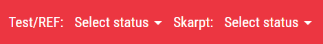
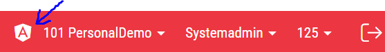
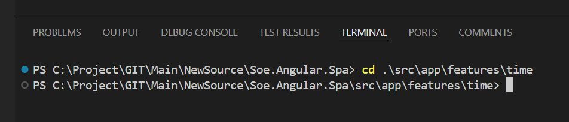
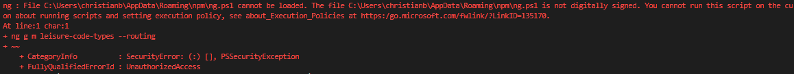

# Migration guide

## Soe.Web  

#### 1. Find correct page to migrate  
* In GO, navigate to the page you are about to migrate.  
* In the Soe.Web project, find the correct WebForms page (default.aspx) by looking at the URL.  
  The folder named soe in the project corresponds to the soe part of the url.  
  So for example, if the URL is: https://main.softone.se/soe/time/preferences/schedulesettings/skilltype/default.aspx  
  the default.aspx file is located in folder soe/time/preferences/schedulesettings/skilltype.

#### 2. Add AngularSpaHost  
* Open the default.aspx file and add the AngularSpaHost control.  

* Add the register line:  
**<%@ Register Src="~/UserControls/AngularSpaHost.ascx" TagPrefix="SOE" TagName="AngularSpaHost" %>**

* Add the control within the if/else statement.  
  Note that you don't need to specify any path or name to the page as you previously needed for the AngularJS page.  
  In new Angular, the route (URL) is used to load the correct component (page) and that is specified in the Angular.Spa project.

  **<%if (UseAngularSpa)  else %>**  

Full example:  
```
<%@ Page Title="" Language="C#" AutoEventWireup="true" CodeBehind="default.aspx.cs" Inherits="SoftOne.Soe.Web.soe.time.preferences.schedulesettings.skilltype._default" %>
<%@ Register Src="~/UserControls/AngularHost.ascx" TagPrefix="SOE" TagName="AngularHost" %>
<%@ Register Src="~/UserControls/AngularSpaHost.ascx" TagPrefix="SOE" TagName="AngularSpaHost" %>
<asp:Content ID="Content1" ContentPlaceHolderID="soeMainContent" runat="server">  
    <%if (UseAngularSpa)  else %> 
</asp:Content>
<asp:Content ID="Content2" ContentPlaceHolderID="soeLeftContent" runat="server">
</asp:Content>
```

* When you have added the code above, save and build the project.  
* Reload the webpage.  

You should now see two page status selectors in the left part of the top menu.  


#### 3. Turn on the new page  

* Change the one called Test/REF to "AngularJS first".  
* You will now be redirected to the module select page, so navigate back to your page.  

At this point you should now see a new icon in the right part of the top menu.  


Clicking on this icon will load the Angular page instead of the AngularJS page. The icon will then change to an image with the letters JS in it.  
Clicking again will switch back to the AngularJS page.

Technically, clicking the icon will add **spa=True** to the URL.  
That will set the **UseAngularSpa** property to true in PageBase, which will then load the AngularSpaHost control in the default.aspx page.

Since you haven't created any Angular page yet, the AngularSpaHost will show a default page with the title **Hello, world!**

For now, leave it like that and move on to the next project...

## Soe.Common  

#### 1. DTOs

* Check that both an ordinary DTO and a GridDTO exists for the type of data your page will contain.  
  For example a SkillTypeDTO and a SkillTypeGridDTO.  

Usually most simple table DTO's is located in the SoeCompModelDTOs.cs file in the DTO folder.  

* If they don't exist, create them and make sure they both have the [TSInclude] attribute.  
  That attribute will automatically generate an interface for the DTO in the Angular.Spa project.  
  (if you have installed the TypeWriter extension as mentioned in the [SetupEnvironment document](https://dev.azure.com/softonedev/XE/_git/Main?path=/_Documentation/SetupEnvironment.md&version=GBmaster&_a=preview)).


#### 2. ToDTO() extension methods

In the Soe.Data project under folder Models, there should be a file for your entity (table).  
In some cases multiple entities share the same file if they are related.  
For example Skill and SkillType are both located in the Skill.cs file together with some additional related entities.  

* If you don't find a suitable file, right click the DTO's class name and select "Find All References" and look if a ToDTO() or a ToGridDTO() method was found.

* If one or more of the DTO's for your entity is missing a ToDTO(), ToDTOs(), ToGridDTO() or ToGridDTOs() method, create these by looking at a similar entity.  
  * The ordinary DTO should have a ToDTO() and a ToDTOs() method.  
  * The GridDTO should have a ToGridDTO() and a ToGridDTOs() method.  

* **Avoid Lazy loading**  
  In some old ToDTO() methods there is a region called `Try Load`. That part will do lazy loading of related entities if specified as in-parameters.  
  We don't use that anymore (could be bad performance). So if you copy a method to create your own, make sure you remove and lazy loading.  
  Related entity DTO's should only be added if the relation is already loaded.

## Soe.Business  

Take a look at the method returning data for the grid.  
If you are uncertain which method it is, here is an easy way of finding it:  
#### 1. Right click the ToGridDTOs() method and select "Find All References".  
#### 2. Look at the result and locate a reference from the Web.Api project.  
  The method is usually called something like GetSkillTypes()

### Relations
Make sure the method doesn't include unneccessary relations without any conditions. If so, add parameters to opt in for relations not needed for the grid.  

### Add ID in query
Add support for passing in id in the method returning grid data (return only one, still as a list)  
Example:  
```
public List<SkillType> GetSkillTypes(int actorCompanyId, int? skillTypeId = null)
{
    IQueryable<SkillType> query = (from s in CompEntitiesReadOnly.SkillType
                                 where s.ActorCompanyId == actorCompanyId &&
                                 s.State == (int)SoeEntityState.Active
                                 select s);

    if (skillTypeId.HasValue)
        query = query.Where(s => s.SkillTypeId == skillTypeId.Value);

    List<SkillType> skillTypes = query.ToList();
    
    return skillTypes.OrderBy(s => s.Name).ToList();
}
```  

The reason for this is that whenever we add a new or update an existing record in new Angular, we don't reload the whole grid anymore, only the affected record.  
But we still want to return it as a GridDTO, therefore we want to call the GetGrid method, but only returning one record.

## Soe.Web.Api  
A new goal is to separate controllers a bit more similar to EVO backend.  
Therefore we make them much smaller, more divided into entities or small areas.  

#### 1. Create controller in V2 directory  
We don't reuse old routes used in AngularJS. We always make a new copy, even though they might be identical.  
The reason for that is to be able to track which routes that are migrated and actually used.  

* First, locate the controller that is used for the AngularJS page that you are migrating.  
* Then, look under the V2 folder and see if there already is a suitable controller for your entity, otherwise create one.  
  Keep them small but related entities could exist in the same controller. For example, Skill and SkillTypes both exists in the SkillController.

**Make sure controller name doesn't exist ANYWHERE in the Soe.Web.Api project or else they will collide!**  
Not just under the V2 folder, they must also be unique against  old controllers directly under Controllers folder.

*When saving the controller file, TypeWriter will detect any changes and start generate the service endpoint file in Soe.Angular.Spa project with the method names and paths.  
These will be utilized later on when creating the components service methods.  
(Maybe you need to add at least one method before TypeWriter will actually generate the file)*  

#### 2. Copy relevant api calls  
From the AngularJS controller copy relevant routes into your new V2 controller.  
As a base, it should contain these four CRUD routes:
* GetGrid  
* Get  
* Save  
* Delete  

As a coding standard these should be named like this:
* [HttpGet]  
  [Route("Grid/{skillTypeId:int?}")]  
  GetSkillTypesGrid(int? skillTypeId = null)  
* [HttpGet]  
  [Route("{skillTypeId:int}")]  
  GetSkillType(int skillTypeId)  
* [HttpPost]  
  [Route("")]  
  SaveSkillType(SkillTypeDTO model)  
* [HttpDelete]  
  [Route("{skillTypeId:int}")]  
  DeleteSkillType(int skillTypeId)  


#### 3. Add id to grid query  
* Make sure you add the id parameter to the GetGrid query.  
* Also rename endpoint (route) to just "Grid". It probably had a name like GetSkillTypes before.  
  That makes all these four CRUD routes having the same name in Angular, regardless of entity.  

```  
[HttpGet]
[Route("Grid/{skillTypeId:int?}")]
public IHttpActionResult GetSkillTypesGrid(int? skillTypeId = null)
{
    return Content(HttpStatusCode.OK, cm.GetSkillTypes(base.ActorCompanyId, false, skillTypeId).ToGridDTOs());
}
```  

### Build  

For now, we are done on the server side.  
**Before starting in the Angular.Spa project you have to build the solution.**  

## Soe.Angular.Spa  
  
### Angular CLI

Use Angular CLI in the terminal window to create some new files.  

Angular CLI has a lot of nice commands to help you.  
It's a good practice to use it for creating components, services, modules etc.  
It will create files with boilerplate code and saves you a lot of time and errors.  

Here is a refrence to the commands. The one we use the most is [generate](https://v17.angular.io/cli/generate) or "g" in short.  
[Angular CLI](https://v17.angular.io/cli)  

In the different commands below, we use two "constants" where you should type your own entity.  
*<TOP_MODULE>* it the name of the top feature module in GO and could be for example **billing** or **time** etc.  
*<COMP_NAME>* is name of the component (in 'Kebab case' and plural) and colud be for example **skill-types**.  

  
  
> :memo: **Note:** If you experience any issues like below when running CLI commands, then you may have to change the Execution Policy in your environment.  
> (See further in [Setup Environment Guide](https://dev.azure.com/softonedev/XE/_git/Main?path=/_Documentation/SetupEnvironment.md&version=GBmaster&_a=preview) how this is done)  
>   


#### 1. Modules
* In the terminal window, move to the top module (cd src/app/features/<TOP_MODULE>)  
* Type the following Angular CLI command:  
  `ng g m <COMP_NAME> --routing` 

This will create a new folder with the same name as your component.  
Inside the folder it will create two modules.  
One that configures imports and exports for your component and one that configures routing for your component.

#### 2. Container component
* Move to the newly created folder in the terminal (cd <COMP_NAME>) and type:  
  `ng g c -t -s --no-standalone components/<COMP_NAME>`  

This will create a new folder called components. In that folder it will create a component called <COMP_NAME>.  
This component consists of two files:  
A TypeScript file (<COMP_NAME>.component.ts)  
A Test file (<COMP_NAME>.component.spec.ts)  

Normally "ng g c" will also create a template file (.html) and a style sheet file (.scss in our case).  
But, the option -t will skip the template file and -s will skip the style sheet file.  
We don't need them in this first container component.  

What it does instead is creating an inline template and style sheet inside the ts-file.  
For the container component (which will hold the tabs) we use a generic template file, so we will need to reference that in our component.  
But more on that later.  

#### 3. Grid component

* To create the grid component type:  
  `ng g c -t -s --no-standalone components/<COMP_NAME>-grid`  

#### 4. Edit component

* To create the edit component type:  
  `ng g c -s --no-standalone components/<COMP_NAME>-edit`  

**Note that the -t option should NOT be specified here, since we want to create a separate html file for the edit component.**  

Instead of creating an inline template in the **template** property, it will now set the path to the html file in the **templateUrl** property.  

#### 5. Add routing
* Open the **<COMP_NAME>-routing.module.ts** file.  
* In the routes property, add a reference to the new component, like this:  
```
const routes: Routes = [
  {
    path: 'default.aspx',
    component: SkillTypesComponent,
  },
];
```
* Set the cursor on the component name and press Ctrl+. to import the reference.  

* Open the **<TOP_MODULE>-routing-module.ts** file.  
  A tip for finding a file easy is to press Ctrl+P and start typing the name (time-routing) and pressing Enter on the file in the drop down list.  
* In the routes property, add a reference to the new component, like this:  
```
{
  path: 'preferences/schedulesettings/skilltype',
  loadChildren: () =>
    import('./skill-types/skill-types.module').then(m => m.SkillTypesModule),
},
```

**Add the routes in alphabetic order!**  
That will make it much easier to locate and modify later if neccesary.  
It also makes it easy to see which routes are migrated.  

**How does these route files work?**  
The top module routing file contains all routes within that GO module. If a route (URL) match, it will load the module specified (in this example, *SkillTypesModule*).  
When that module is loaded, it will look for a routing file within that module and then look for a matching route to see what component to load.  
In this case the URL ends with default.aspx which will match the *SkillTypesComponent*.  

#### 6. Service

The component should have it's own service for the usual CRUD operations that is usually not shared to other components.  
* To create a service type:  
  `ng g s services/<COMP_NAME>`  

This will create a new folder called services. In that folder it will create a service called <COMP_NAME>.service.ts.  
It will also create a test file (.spec.ts) for the service.  

#### 7. Model

The component should have a model file for the form model (more on that later).  
Lets create it now by typing:  
* `ng g cl models/<COMP_NAME>-form --type=model`  

This will create a new folder called models. In that folder it will create a model class with a related test file.

Now we have created all the neccesary files for our component (page).  

### Start file watcher  

Now when all files are created, we can build the project and start watching for file changes.  

* In terminal window, type:  
  `npm run watch`  

This will initially build the whole project and then watch for modified files.  
It will take some time until it's initially done, but then it only builds modified files and files dependant on the modified ones.  

**Make sure you don't get any build errors!**  
If there are any build errors at this stage, there is probably something wrong or missing in one or more of the stages above.  

* If there are no build errors, you can now go back to the browser and refresh the page.  

If everything is OK, instead of the hello world page, you should get a blank page with some text saying that your component is working.  
If not, there might be some problem with the routings.  
  
> :memo: **Note:** Don't forget to manually start the file watcher everytime you start the editor anew.  
  
Next up, lets start adding code to our empty files...

### Add content to your files  

#### 1. DTO's

In AngularJS we specified in a file called *TypeLite.Net4.tt* which DTO's from the Soe.Common project that we wanted to use.  
*TypeLite* would then automatically create an interface for those DTO's in the file *TypeLite.Net4.d.ts.*  
We could then create DTO's that would implement those interfaces.  
Most of those DTO files are located in the *TypeScript/Common/Models* folder.

Now in the Soe.Angular.Spa project we use TypeWriter as stated before.  
By adding the attribute *[TSInclude]* on a DTO, TypeWriter will automatically create the interface for us.  
The good thing about this is that if you would change the DTO in the Soe.Common project,  
it will automatically update the interface in the Soe.Angular.Spa project, causing build errors if you have done a breaking change.  
That is something we had a problem with in AngularJS, where you manually needed to run the tt-script to update the interface.  

In AngularJS, we always created DTO's, at least for the edit page entities. There, the DTO's were the actual object we worked with and bound to the view.  
We also sometimes created extension methods in the DTO. Therefore it was neccessary to convert the JSON from the server to an actual DTO object on the client side,  
otherwise you could not take advantage of extension methods or get correct data types, for date for instance.  

But now, in the new Angular project, a DTO is just a **Data Transfer Object**. We actually don't need to create the DTO's on the client side, the interface is enough.  
When we load data from the server, we copy the data into our form model with something called patching.  
There is no need for an extra conversion step to a DTO before that.  
And, we don't use extension metods in the DTO's anymore, they should be in the form model as well.

If this is the first time you migrate, you need to make sure that the TypeWriter extension in Visual Studio is working correctly, by doing this:  
* In the file tree in VS Code, go to `src/app/shared/models/generated-interfaces/`.  
  There should be a file created here with the same name as the the file where the DTO is located in the Soe.Common project.  
  Usually most DTO's are located in the *SOECompModelDTOs.cs* file, so there is already a *SOECompModelDTOs.ts* file created here.  
  Open the file and search for your DTO. Note that it's an interface so the name starts with an I, like ISkillTypeDTO.  
  If you don't find it, go back to the Soe.Common project and make sure the DTO has the attribute [TSInclude].

#### 2. Service

Add calls in your components service for generated service-endpoints from above step.  

If this is your first service, make sure that the TypeWriter extension in Visual Studio is working correctly.  
* In the file tree in VS Code, go to `src/app/shared/services/generated-service-endpoints/<TOP_MODULE>`.  
  There should be a file created here with the same name as the controller you created in the Web.Api project and the extension *.endpoints.ts*.  
  The content of the file is an exported property for each route, like this:  
  ```
  //get
  export const getSkillType = (skillTypeId: number) => `V2/Time/Skill/SkillType/${skillTypeId}`;
  ```  

The good thing about this is that if you would change the route on the server side, like adding a parameter for instance,  
it will automatically update the property here, causing build errors until you have done the same addition in every service that use this endpoint.  
That is something we have a problem with in AngularJS, especially if multiple services use the same route on the server side.  

* Open the <COMP_NAME>.service.ts file.  
* Add our own http client in the constructor:  
  ```
  constructor(private http: SoeHttpClient) {}
  ```

* Add methods for the four CRUD operations you created in the Web.Api controller.    
  The easiest way is to look at a similar components service, copy them and modify the DTOs and name of the endpoints.  

As an example this is how the get operation mentioned above is implemented in the service:
```
get(id: number): Observable<ISkillTypeDTO> {
    return this.http.get<ISkillTypeDTO>(getSkillType(id));
}
```

And the rest of the service methods should follow the same principle, and note that it's important that the names of the methods here is **getGrid()**, **get()**, **save()** and **delete()**.  
If you notice that you don't have a matching endpoint path in the generated file, then you need to go back to Web.Api project and add that endpoint in the controller.  
Saving it should generate the service endpoint file again with your new changes.  

#### 3. Container component (tabs)  
* Open the **<COMP_NAME>.component.ts** file and remove the template and styles properties.  
* Add a templateUrl property that points to our generic template file:  
```
templateUrl:
    '../../../../../shared/ui-components/tab/multi-tab-wrapper/multi-tab-wrapper-template.html',
```

Verify that the path is correct. The number of ../ may be different depending on where in the tree structure you have created your component.  
There will be a build error later if it doesn't match.

* Also remove the selector property. The selector is only used if the component should be included inside another component.  
  But since this is the container component, it will always be the outmost component.  

* Copy content from similar component and modify accordingly.  

Short explanation of the file content.
```
@Component({
  templateUrl:
    '../../../../../shared/ui-components/tab/multi-tab-wrapper/multi-tab-wrapper-template.html',
})
export class SkillTypesComponent {
  config: MultiTabConfig[] = [
    {
      gridComponent: SkillTypesGridComponent,
      editComponent: SkillTypesEditComponent,
      FormClass: SkillTypeForm,
      gridTabLabel: 'time.schedule.skilltype.skilltypes',
      editTabLabel: 'time.schedule.skilltype.skilltype',
      createTabLabel: 'time.schedule.skilltype.new',
    },
  ];
}
```

* The *config* property is a collection of predefied tabs to show.  
  * Here we specify our *grid* and *edit* component.  
  * FormClass points at our *form model*, more on that one later.  
  * Last we specify three *labels* to be used for the tabs. These labels can be found in the TabsController in the AngularJS project.

If you have a more advanced page with multiple grid tabs for instance, here is where you configure them.  
Simply add another object within the config collection.  
You could also omit the editComponent for instance, if the grid doesn't have any edit component.

At this point you probably get some build errors.  
For example:  
`Can't bind to 'config' since it isn't a known property of 'soe-multi-tab-wrapper'.`

The reason is that your component is not aware of the MultiTabWrapper component.  
You need to specify some declarations and imports in you components module file.
* Open <COMP_NAME>.module.ts.  
  The declarations property should contain all your three components, like this:
  ```
  declarations: [
    SkillTypesComponent,
    SkillTypesGridComponent,
    SkillTypesEditComponent,
  ],
  ```
  The imports property need at least these modules:
  ```
  imports: [
    CommonModule,
    SharedModule,
    ReactiveFormsModule,
    SkillTypesRoutingModule,
    TabModule,
    GridModule,
  ],

  ```
Further on as we start building our edit page, we will need to att more imports here.  
For example every UI component has it's own module, like the TextboxModule for instance.  
That is because we only want to import the modules and components we actually use,  
not as in the AngularJS project where every page always import a core library which for example contains all UI components.

#### 4. Grid component  
* Open the **<COMP_NAME>-grid.component.ts** file and remove the template and styles properties.  
* Add a templateUrl property that points to our generic grid template file:  
```
templateUrl:
    '../../../../../shared/ui-components/grid/grid-wrapper/grid-wrapper-template.html',
```

* Add a providers property to the component like this:  
`providers: [FlowHandlerService, ToolbarService],`  
That means that the component will get it's own instance of the FlowHandlerService and the ToolbarService since they are not singleton services.  
Otherwise it will be shared with other components and that will cause unexpected side effects.

Your grid component should extend the grid base class and also implement OnInit, which is a so called *lifecycle hook* where we can place code to run when the component is initialized.  
The GridBaseDirective takes a type (here you specify the GridDTO or actually the interface) and a service to be used.  
Also, it's important to inject the service and it must be called service (which is a defined property in the GridBase).

```
export class SkillTypesGridComponent
  extends GridBaseDirective<ISkillTypeGridDTO, SkillTypesService>
  implements OnInit {
    service = inject(SkillTypesService);
  }
```
* Add the ngOnInit() method, like this:
```
ngOnInit() {
  super.ngOnInit();

  this.startFlow(
    Feature.Time_Preferences_ScheduleSettings_SkillType,
    'Time.Schedule.SkillTypes'
  );
}
```

* Remember to add a call to *super.ngOnInit()* which will call the method in the base class.  

As you can see, we use what we call a flow handler, similar to what we have on the AngularJS side.  
The flow handler is used both for the grid and for the edit page.  
It can be configured in many ways for fetching neccesary data, like permissions, company settings, terms, lookups and so on.  

For the grid component, the permission and a unique grid name is mandatory.  
It will load both read and modify permissions, which in turn will allow or deny you from editing a record.  
The grid name is used if the end user want to save a custom state of the grid (hiding columns for example).  

When migrating, both the permission and the grid name can be found in the GridController in the AngularJS project.  
Grid name here:  
`super(gridHandlerFactory, "Time.Schedule.SkillTypes", progressHandlerFactory, messagingHandlerFactory);`  
Permission here:  
`this.flowHandler.start({ feature: Feature.Time_Preferences_ScheduleSettings_SkillType, loadReadPermissions: true, loadModifyPermissions: true });`

Next up is to configure the actual grid columns.  
When the flow handler is done, it will call a method named **gridReadyToDefine()**.
In your grid component you should override that method like this:
```
override gridReadyToDefine(grid: GridComponent<ISkillTypeGridDTO>) {
  super.gridReadyToDefine(grid);

  this.translate
    .get(['common.active', 'common.name', 'common.description', 'core.edit'])
    .pipe(take(1))
    .subscribe(terms => {
      this.grid.addColumnActive('state', terms['common.active'], {
        idField: 'skillTypeId',
        editable: true,
      });
      this.grid.addColumnText('name', terms['common.name'], { flex: 25 });
      this.grid.addColumnText('description', terms['common.description'], {
        flex: 75,
      });
      this.grid.addColumnIconEdit({
        tooltip: terms['core.edit'],
        onClick: row => {
          this.edit(row);
        },
      });
      super.finalizeInitGrid();
    });
}
```
* Remember to set correct GridDTO interface type in the grid parameter.  
* Also here, remember to call the super method.  
* Then we make a call to the translate service, fetching terms needed for the grid.  
* Then add all columns. It's quite similar to AngularJS but a bit more structured.  
  Every column type has two mandatory properties, **field** and **headerName** and then an optional **options** property where you specify all other settings for the column.
    * The **flex** parameter in the options property specifies the column width.
      All columns with a flex parameter will be sized proportionally against each other.  
      For example, description will be three times wider than name in the example above.
      You can type any number, it can be 1 and 3 also, but it's recommended to have a sum of 100, thinking of them as percentage.

To get an idéa of what you can do in a grid component, the easiest way is to look at other already migrated pages.  
You might for instance need to load some lookups for select columns, extend the toolbar and so on.

#### 5. Create form model in <COMP_NAME>-form.model.ts  
Before we start to design our edit component, we need to create the form model.  
In Angular there are two ways of binding data between the component and it's html file, **Template-driven Forms** and **Reactive Forms**.  
Template-driven forms is more like how we do it in AngularJS where you use "banana in a box" two way binding in html: `[(ngModel)]="ctrl.skillType.name"`.  
But we have decided to use Reactive Forms here. It gives you more control of your view in the TypeScript file instead of in the html file, which I think more of us like better.

Here is an example of a simple form model:
```
interface ISkillTypesForm {
  validationHandler: ValidationHandler;
  element: ISkillTypeDTO | undefined;
}
export class SkillTypesForm extends SoeFormGroup {
  constructor({ validationHandler, element }: ISkillTypesForm) {
    super(validationHandler, {
      skillTypeId: new SoeTextFormControl(element?.skillTypeId || 0, {
        isIdField: true,
      }),
      name: new SoeTextFormControl(
        element?.name || '',
        { isNameField: true, required: true, maxLength: 100, minLength: 1 },
        'common.name'
      ),
      description: new SoeTextFormControl(
        element?.description || '',
        { maxLength: 512 },
        'common.description'
      ),
    });
  }
}
```

The interface has an element property that specifies the DTO that we will bind the form to.  
In the constructor of the form we setup all fields from the DTO that we want to use.  
For each field we specify what kind of form control to use, like SoeTextFormControl above.  
  There are others for Checkbox, Date, Select and so on.

Two options are important to add (only on one field each):
  * **isIdField** must be added to the primary key field.  
  * **isNameField** must be added to the field that holds the display name of the record (used for example in the tab label).  

These two properties are used in base classes and some other places so that we don't need to specify them in more places.  
As you can see in the example, here you can also specify if the field is required, max lengths and more.  
The term specified is used for displaying validation errors, like required for instance.  

If you have more advanced forms, look in any other page to se more examples.

#### 6. Edit component
Now its time to start on the edit component.

* Open <COMP_NAME>-edit.component.ts  
* We don't need the empty styles property, so remove it.

**Note that in some rare cases you will have a component that needs some special styling.**  
In that case, just omit the -s option when you create it and let it generate a .scss file.  

If you later on notice that you need your own styles, simply create a file with the same name as the component but with the extension .scss.  
Then add the styleUrls property to the component:
```
styleUrls: ['./<COMP_NAME>.component.scss'],
```

* Add a providers property to the component like this:  
`providers: [FlowHandlerService, ToolbarService],`  
That means that the component will get it's own instance of the FlowHandlerService and the ToolbarService since they are not singleton services.  
Otherwise it will be shared with other components and that will cause unexpected side effects.

Your edit component should extend the edit base class and also implement OnInit, like this:  
```
export class SkillTypesEditComponent
  extends EditBaseDirective<ISkillTypeDTO, SkillTypesService, SkillTypesForm>
  implements OnInit
```
Note that the EditBaseDirective takes three types, here you specify the DTO, the service and the form.

* Inject the service:
`service = inject(SkillTypesService);`

* Add the ngOnInit() method, like this:
```
ngOnInit() {
  super.ngOnInit();

  this.startFlow(Feature.Time_Preferences_ScheduleSettings_SkillType_Edit);
}
```

* Remember to add a call to *super.ngOnInit()* which will call the method in the base class.  
* Also make sure you specify the correct permission.  
  On some old pages there are different permissions for the grid and edit page.  
  The edit page then often have **_Edit** at the end.  


Here is a simple example of an edit component:
```
@Component({
  selector: 'soe-skill-types-edit',
  templateUrl: './skill-types-edit.component.html',
  providers: [FlowHandlerService],
})
export class SkillTypesEditComponent
  extends EditBaseDirective<ISkillTypeDTO, SkillTypesService, SkillTypesForm>
  implements OnInit
{
  service = inject(SkillTypesService);

  ngOnInit() {
    super.ngOnInit();

    this.startFlow(Feature.Time_Preferences_ScheduleSettings_SkillType_Edit);
  }
}

```

This is actually all you need for a simple page that doesn't contain any lookups or other special functionality.  
Most of the common boilerplate code is tucked away in the base class.

**Now it's time for the view in the html file.**

* Open <COMP_NAME>-edit.component.html  
* Remove any auto generated content.  

Most edit components should have a toolbar, so add it like this:  
```
<soe-toolbar
  [recordConfig]="recordConfig"
  [form]="form"
  [itemGroups]="toolbarUtils.toolbarItemGroups"
  (navigatorRecordChanged)="navigatorRecordChanged($event)">
</soe-toolbar>
```

* To make your component aware of the *soe-toolbar* component, you need to go back to your module.ts file and add an import to the ToolbarModule.

Short explanation:  
* [recordConfig] is a configuration for the racord navigator (arrows to the left in the toolbar tpo move between records).  
* [form] is bound to your form model.  
* [itemGroups] contains the toolbar items (buttons).  
* (navigatorRecordChanged) is an event that is emitted when moving with the record navigator.  

There are more to the toolbar component, but lets not get into that now. As default your edit component will get a copy button.

Now for the actual fields.

The easiest way is to copy content from another page.  
This is a simple page:  
```
@if (form) {
  <form [formGroup]="form" class="soe-edit-form" novalidate autocomplete="off">
    <div class="row">
      <div class="col-sm-2">
        <soe-textbox
          [labelKey]="'common.name'"
          [maxLength]="100"
          [autoFocus]="true"
          formControlName="name">
        </soe-textbox>
      </div>
      <div class="col-sm-4">
        <soe-textbox
          [labelKey]="'common.description'"
          [maxLength]="512"
          formControlName="description">
        </soe-textbox>
      </div>
    </div>

    <soe-edit-footer
      [form]="form"
      [idFieldName]="idFieldName"
      [modifyPermission]="flowHandler.modifyPermission()"
      [inProgress]="performAction.inProgress()"
      (saved)="performSave()"
      (deleted)="triggerDelete()"></soe-edit-footer>
  </form>
}
```

If you paste this below your toolbar configuration you will get some errors again.  
As stated before, all UI components has their own modules that needs to be imported separately.  
So, for this content you also need to import the following modules:
* TextboxModule  
* FooterModule  

Whenever you get a build error like **Can't bind to 'XXX' since it isn't a known property of 'YYY'**  
That normally means that you need to import the module that contains the component here refered to YYY.

We will not go into detail here what all properties and binding on all the components means.  

* If you open a UI coponents ts file, you will see some properties declared as **input()**.  
  These are input parameters that you can bind in your html with the bracket syntax `[parameter]="propertyName"`.  
* There are also properties declared as **output()**.  
  These are output parameters, or events, that you bind inside parentheses `(parameter)="eventName()"`.

**Now, if you don't have any build errors left. Go to the browser and reload the page again.  
You should now see a grid with some records and be able to open them in the edit page!**

If your page was very simple, you are now done!  
Otherwise continue to add more fields to the form, add lookups, maybe extend the toolbar and so on.  
Also, don't hesitate to ask any questions if you get stuck or just wonder how things work...

### Last words  
* Use document ["Angular Migration Checklist"](https://dev.azure.com/softonedev/XE/_git/Main?path=/_Documentation/AngularMigrationChecklist.md&version=GBmaster&_a=preview) as a help to assure the quality of the migrated pages.  
* Next time you migrate or create a new page, you can use ["Migration guide - Short version"](https://dev.azure.com/softonedev/XE/_git/Main?path=/_Documentation/MigrationGuideShort.md&version=GBmaster&_a=preview) if you only want a reminder of the steps.
