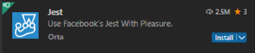
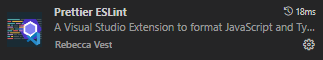

# Setup Environment

## 1. Install VS Code
- <https://code.visualstudio.com/download>

## 2. Install latest Node (lts)
- <https://nodejs.org/en>
- minimum v20.11.1 (to run Angular 18.2)
- Type node -v in terminal window to see your version

## 3. Enable long path support in your Git config
We tend to have rather long names and nestled folders which can cause problems for Git in Windows environments.  
When syncing files that have long paths you can experience that those files are not synced to your environment and files will be missing in your local repository.  
To avoid this you should enable long path support in Git config.  
Do this by opening command prompt as administrator and run this command:  
  
`git config --system core.longpaths true`  
  
Also do a little hack in the registry:  
  
Make sure that registry key  
`HKEY_LOCAL_MACHINE\SYSTEM\CurrentControlSet\Control\FileSystem\LongPathsEnabled` exists and is set to 1 (Type: REG_DWORD)  

## 4. Add extension Prettier ESLint to VS Code
- (See separate guide down below)

## 5. Add extension Jest to VS Code
  

### Configure
Click on the cog and select *Settings* to configure Jest.  
Scroll down to *Jest: RunMode* and select *Edit in settings.json*.  
It will add a setting called runMode, change it to on demand like this:  
**"jest.runMode": "on-demand"**  
That means you manually have to run the tests. As default they will run as soon as you change something and it rebuilds.  
The tests are quite heavy, so we don't want to always run them.

## 6. Add extension GitHub Copilot to VS Code

## 7. Add extension GitHub Copilot Chat to VS Code

  
## 8. Add extension Angular Language Service  
  
To get code intelligence in HTML.  
Click on the cog and select *Settings* to configure.  
Check the *Force Strict Templates* checkbox to get the most complete information in the editor.  
  
## 9. Add extension TypeWriter to Visual Studio
- [TypeWriter](https://github.com/AdaskoTheBeAsT/Typewriter/releases)  
  *2.32.0 was the latest verified version at the time this documentation was created. [v2.32.0](https://github.com/AdaskoTheBeAsT/Typewriter/releases/download/v2.32.0/Typewriter.vsix)*
- Try if TypeWriter works by opening a DTO-file and save it. I should have a tag [TSInclude] for the DTOs for it to generate the file in shared/models/generated-interfaces.  
  
## 10. Install Angular CLI  
Ensure you have Angular CLI installed.  
To install, run in terminal (powershell):  
`npm install -g @angular/cli`  
  
## 11. Ensure execution policy  
CLI commands is dependent on the execution policy in your environment.  
Ensure that you have proper execution policy set by running this command in terminal for listing each execution policy for different scopes:  
`Get-ExecutionPolicy -List`  
  
Verify that you have `RemoteSigned` policy for the `LocalMachine` scope (or CurrentUser).  
(Usually it is Undefined for all scopes but for LocalMachine)  

If you have another execution policy set then you need to change this to avoid potential problems.  
For instance, if having the policy AllSigned you will probably experience problems running CLI commands. 
  
<ins>Changing execution policy</ins>  
Type in terminal:  
`Set-ExecutionPolicy -ExecutionPolicy RemoteSigned -Scope LocalMachine`  
Note! You can only change this when running terminal as administrator.  
(Easiest is to just click on the windows start menu and type 'powershell', right-click it and choose 'Run as Administrator')  
  
# Prettier ESLint

## Step to get formatter and linter to work

## 1. Install "Prettier ESLint" package in VScode.

- (Better to install the combined "Prettier ESLint" extension to avoid strange formatting errors on carriage returns)

## 2. Go to a "TS"-file and press CTRL+SHIFT+P
- 2.a This will prompt a popup where you can select formatter - select prettier.
- 2.b Repeat Step 2 and 2a for "SCSS", "HTML" and "JSON" files.
  
## Setting up format on save

1. Open VSCode and enter "CTRL+comma"
2. In the menu that appears press on "Text editor" => "Formatting"
3. Tick the second checkbox where it says "Format on save"

Linter and formatter should now be up'n'running.